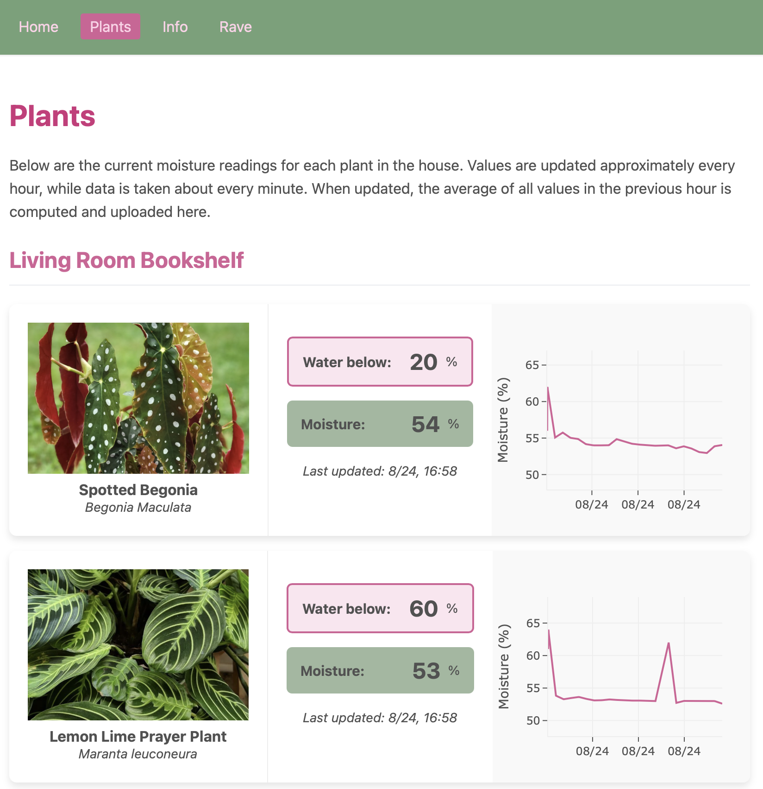
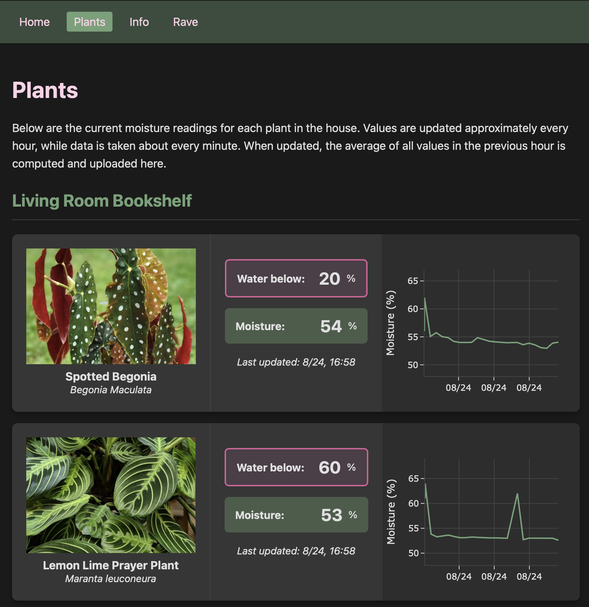

# Home Environement and Plant Monitor

This repository contains the code used to host [crabdance.milescb.com](https://crabdance.milescb.com/), a home environment and plant moisture monitoring system. The following contains instructions on how to get your own website running! If you would like the original instructions I made for hosting on a Raspberry Pi Zero 2w, visit the [info](https://crabdance.milescb.com/pages/info.html) page of [crabdance.milescb.com](https://crabdance.milescb.com/). 

### Website Main Page

<p align="center">
	<br>
	<!-- <em>Main Page (Light Mode)</em> -->
</p>

<p align="center">
	<br>
	<!-- <em>Moisture History Chart Example</em> -->
</p>

### Website Plants Page

<p align="center">
	<br>
	<em>Light Mode</em>
</p>

<p align="center">
	<br>
	<em>Dark Mode</em>
</p>

## Website configuration

First, clone this repostitory, then follow the steps below:

1. Configure a website server to host your website, as detailed below. 
2. Change the script `python/subscribe.py` to match the plants you have.
3. Launch the `python` scripts to run the database API, and the MQTT server.
4. Install hardware according to the documentation in the `esp8266` directory, and flash the appropraite software to your esp developement board, using the same name for plants you set in step 2. 
5. Update the configuration in `website/config/plants-config.json` to match the plants you specified in step 2. 

## Configuring a website server 

I use `nginx` as the server engine. To install, run:

```bash
sudo apt install nginx
sudo systemctl start nginx
sudo systemctl enable nginx
```

### Obtaining a free domain

One way to expose your website to the outside world is to use [FreeDNS](https://freedns.afraid.org) to obtain a free domain name and subdomain. To get this running, forward the http port (port 80), and the https port (port 443) on your home router. Then, obtain the IP address of your home router, and configure your selected subdomain with FreeDNS. You can then use this free url in the below configuration!

#### Warning!

Exposing ports on your home internet can expose your device to attacks. In order to mitigate risks, ensure ssh is only enabled through ssh keys and do not forward port 22. Additionally, installing `fail2ban` and configuring a jail for the forwarded ports, as well as creating a firewall, for instance with `ufw`, provide additional security. I would also recommend additionally security measures, and understand all risks associated with port forwarding. 

### Using `Cloudflare` for increased security

Another option is to purchase a domain, for instance on [cloudflare](https://www.cloudflare.com/products/registrar/). Then, set up [cloudflare tunnel](https://developers.cloudflare.com/cloudflare-one/networks/connectors/cloudflare-tunnel/) on the server and configure the DNS registry to point to this tunnel as in the [cloudflare tunnel](https://developers.cloudflare.com/cloudflare-one/networks/connectors/cloudflare-tunnel/) documentation. The rest of the setup remains the same (although `certbot` configuration is no longer nececcary, and the website configuration should not redict HTTP to HTTPS). 

### Configure website engine (`nginx`)

To configure you website, open the file `/etc/nginx/sites-available/default` and replace the current content with the below code, changing `<YOUR_URL>` to the one selected above and `<WEBSITE_LOCAL_DIR_LOCATION>` to the local location you plan on hosting your site from (the full path pointing to the `website` directory in this repository).

```
server {
    listen 80;
    listen [::]:80;

    server_name <YOUR_URL>;

    # Redirect HTTP to HTTPS
    return 301 https://$host$request_uri;
}

server {
    listen 443 ssl;
    listen [::]:443 ssl;

    access_log /var/log/nginx/access.log;
    error_log /var/log/nginx/error.log;

    server_name <YOUR_URL>;

    ssl_certificate /etc/letsencrypt/live/<YOUR_URL>/fullchain.pem;
    ssl_certificate_key /etc/letsencrypt/live/<YOUR_URL>/privkey.pem;

    root <WEBSITE_LOCAL_DIR_LOCATION>;
    index index.html index.htm;

    location / {
        try_files $uri $uri/ =404;
    }
}
```

Note: this is a very bare-bones configuration. Other security measures may be added to enhance the security of the website at configuration level. In the case of the cloudflare solution, remove the first redirect block, and only listen on the 80 port.  

### Configure ssl (optional)

Install `certbot` to deal with obtaining an ssl certificate

```bash
sudo apt update
sudo apt install certbot python3-certbot-nginx
```

Then, run `certbot`:

```bash
sudo certbot --nginx
```

Now you have a secure(ish) website to play around with! Note that this is only necessary if using a free domain. 

## Running `python` services for website support

To create the `python` environment, run

```
python -m venv .venv
source .venv/bin/activate
```
and
```
pip install -r requirements.txt
```

Then, open a `tmux` session and run the python scripts, one in each tmux window:

To subscribe to MQTT messages 
```
cd python
python subscribe.py
```
and run the API to query the database in the background
```
gunicorn --bind 0.0.0.0:5000 --worker-class gevent \
	--max-requests 1000 --timeout 30 sqlite_api:app
```

### Running Processes with `systemd`

For a more permanent solution, run the two python services in the background. To do this, setup two configuration scripts:

```
# /etc/systemd/system/piwebsite-api.service
[Unit]
Description=Gunicorn server for sqlite_api Flask app
After=network.target

[Service]
User=milescb
WorkingDirectory=/home/milescb/PiWebsite/python
ExecStart=/home/milescb/PiWebsite/.venv/bin/gunicorn --bind 0.0.0.0:5000 --worker-class gevent --max-requests 1000 --timeout 30 sqlite_api:app
Restart=always
Environment="PATH=/home/milescb/PiWebsite/.venv/bin"

[Install]
WantedBy=multi-user.target
```

and

```
# /etc/systemd/system/mqtt-subscriber.service
[Unit]
Description=MQTT Subscriber for sensor data
After=network.target

[Service]
User=milescb
WorkingDirectory=/home/milescb/PiWebsite
ExecStart=/home/milescb/PiWebsite/.venv/bin/python python/subscribe.py
Restart=always
Environment="PATH=/home/milescb/PiWebsite/.venv/bin"

[Install]
WantedBy=multi-user.target
```

Then, enable and start the processes:

```bash
sudo systemctl daemon-reexec
sudo systemctl daemon-reload
sudo systemctl enable piwebsite-api.service
sudo systemctl enable mqtt-subscriber.service

# start the processes
sudo systemctl start piwebsite-api
sudo systemctl start mqtt-subscriber
```

You can check everything is running with

```
journalctl -u piwebsite-api -f
journalctl -u mqtt-subscriber -f
```
